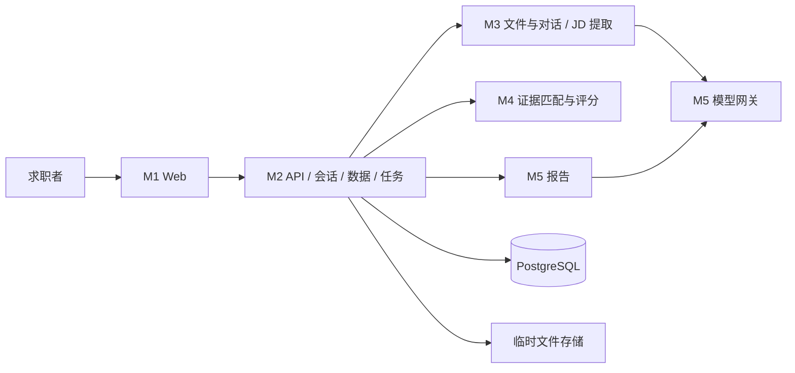

# 架构与模块间契约

## 总体结构

采用单仓库模块化单体，HTTP API 和 worker 共享业务模块与数据库。后端内部使用函数/DTO 协作，不为每个模块另建网络服务。



## 模块目录与所有权

```text
frontend/src/{pages,components,api,types}/       M1
backend/app/api/                              M2 HTTP 路由和输入验证
backend/app/platform/{sessions,repositories,jobs,storage}/  M2
backend/app/intake/                           M3
backend/app/scoring/                          M4
backend/app/reporting/                        M5
backend/app/llm/                              M5
backend/app/contracts/                        M2 协调，各消费者共同评审
backend/migrations/                          M2
backend/tests/{platform,intake,scoring,reporting}/ 各模块负责
frontend/tests/                               M1
tests/e2e/                                   M1 + E 协调
```

## 内部端口

所有 DTO 对应 `api/openapi.json` 中的 Schema。M2 管理版本和资源 ID；M3/M4/M5 不直接访问数据库，不返回 HTTP 响应，不自行创建会话。下面是设计签名，不是已实现函数。

| 端口 | 输入 | 输出 | 负责人/调用方 |
|---|---|---|---|
| extract_document | 受限临时文件句柄、媒体类型 | 原始文本、页段定位、warnings | M3 / M2 worker |
| build_profile | 原始文本、来源类型、可选上一 Profile | ProfileContent | M3 / worker |
| advance_conversation | 用户原文、现有 ProfileContent、历史用户轮次 | assistant_message + ProfileContent | M3 / worker |
| extract_job | JD 原文、公司背景 | JobContent | M3 / worker |
| assess_requirements | 已确认 ProfileContent、JobContent、matcher_version | RequirementAssessment[] | M4 / worker |
| calculate_score | RequirementAssessment[]、rule_version | ScoreResult | M4 / worker |
| generate_report | 已确认快照、ScoreResult、模型元信息 | ReportContent | M5 / worker |
| export_markdown | 已存储 DiagnosisItem | UTF-8 Markdown 文本 | M5 / M2 API |
| generate_structured | task_name、无敏感字段上下文、输出 Schema、超时 | 通过 Schema 的 JSON、model/prompt 元信息 | M5 / M3 或 M5 |

`ProfileContent` 包含 overview、facts、evidence；`JobContent` 包含 requirements、company_context。模型提取证据引用需验证为真实来源子串。M3 不认领最终匹配分，M5 不认领前端报告页面。
M4 v1 使用明确字段、受控同义词和数值条件，不能处理的语义返回 unknown。向量相似度、LLM 直接判分后续再讨论。

## 版本与状态

档案和岗位的资源 ID 固定，内容版本递增；confirmation 是对指定版本的确认，不覆盖内容。内容编辑携带 base_version，过期返回 409。所有 GET 默认返回 latest_version；历史版本通过 version 查询。
诊断创建时复制指定已确认版本引用，之后编辑不会影响进行中或历史诊断。

任务：queued → running → succeeded / partial / failed。只有诊断任务允许 partial。每岗位结果：pending → scoring → reporting → succeeded / score_only / failed。score_only 表示有评分、无 AI 报告，前端可正常展示和导出规则明细。
诊断聚合：所有岗位 succeeded 则 succeeded；至少一项有评分而非全 succeeded 则 partial；全部无评分则 failed。
解析失败不会产生“确认完成”的档案；对话失败不写半成品消息或草稿版本。

## Worker 与恢复

M2 在事务中创建 queued task，worker 使用行锁领取，记录 attempt、lease_until 和 heartbeat。租约 60 秒、每 15 秒续约；调用模型期间同样续约。失去租约的 worker 不得提交结果，使用 lease_token 校验。
最多 2 次领取；崩溃后租约过期可重新领取，所有结果按 task_id/item_id 唯一键 upsert，不能重复创建档案版本。超过 5 分钟总截止时间终态失败；已完成岗位保留，聚合为 partial。模型内部至多一次重试，计入总截止时间。
删除会话先标记 revoked，所有提交事务再次检查会话有效；取消任务后再清理文件和数据，防止后台重新写回。

## Mock 与集成

先共同合并 API v0.1 和合成样例。M1 用契约样例搭页面；M3 使用 FakeModelGateway；M4 不依赖数据库或模型；M5 直接消费固定 ScoreResult；M2 用假模块串通任务链。实现阶段再替换真实适配器。
集成顺序：会话/假任务 → 对话建档 → JD → 纯评分 → 报告 → 文件输入 → 端到端。每次只替换一个假模块，保留相同契约。
