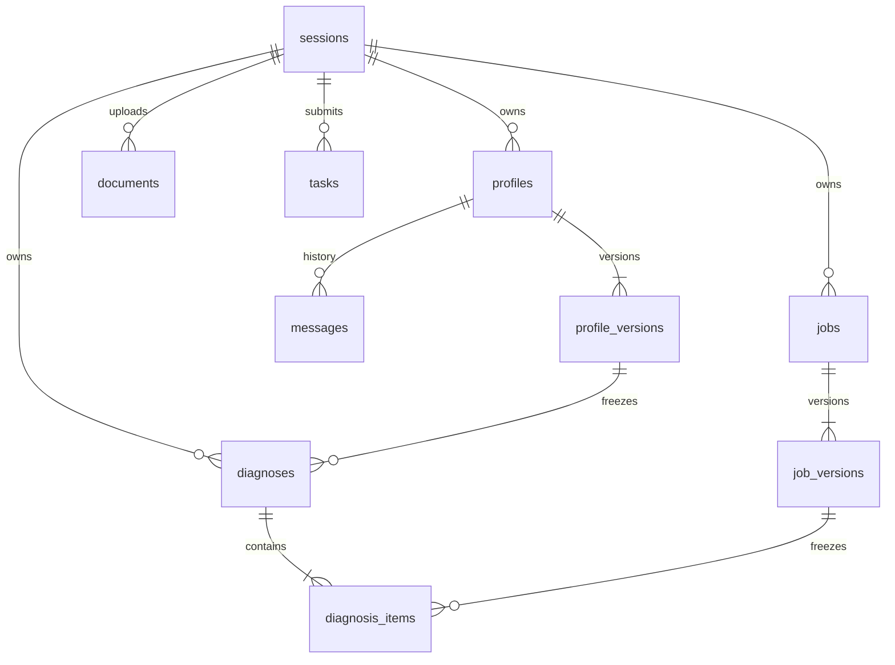

# 数据库设计 v0.1

使用 PostgreSQL；本文为设计，不创建迁移。所有 UUID 由服务端生成，时间为 UTC timestamptz，对外 ISO 8601。内容快照使用 JSONB 并由共享 Schema 校验；表/字段命名 snake_case。

## 关系

## 通用约定

每张资源表带 session_id（FK sessions.id）、created_at。所有读写按 session_id 过滤；UUID 无法猜测不等于授权。内部复合外键/事务校验保证资源确实属于同一会话。
版本表以 (resource_id, version) 唯一；version 从 1 递增。latest_version 指向已提交完整版本；confirmed_at 可从 null 更新一次，内容不可变。修改已确认内容必须创建新版本。
以下 `?` 表示可空；未标记为非空。数组无数据时为 []，JSON 对象不得保存未验证模型原始输出。

## 表与字段

| 表 | 关键字段与类型 | 约束 / 索引 |
|---|---|---|
| sessions | id uuid PK；token_hash text unique；consent_version text；expires_at timestamp；revoked_at timestamp?；created_at | 服务端只保存随机 cookie token 的哈希；expires_at 索引 |
| profiles | id uuid PK；session_id uuid；latest_version int；created_at | (session_id,id) unique；latest_version>=1；归属复合 FK |
| profile_versions | profile_id uuid；session_id uuid；version int；content jsonb；confirmed_at timestamp?；created_by_task_id uuid?；created_at | PK(profile_id,version)；created_by_task_id unique；FK profiles；content 对应 ProfileContent |
| documents | id uuid PK；session_id uuid；profile_id uuid?；storage_key text?；original_name text；media_type text；size_bytes bigint；status text；deleted_at timestamp?；created_at | size<=10 MiB；状态 stored/processing/parsed/failed/deleted；禁止对外返回 storage_key |
| messages | id uuid PK；session_id uuid；profile_id uuid；task_id uuid；role text；content text；created_at | role=user/assistant；unique(task_id,role)；索引(profile_id,created_at)；只有成功轮次事务写入 |
| jobs | id uuid PK；session_id uuid；latest_version int；created_at | (session_id,id) unique |
| job_versions | job_id uuid；session_id uuid；version int；raw_text text；content jsonb；confirmed_at timestamp?；created_by_task_id uuid?；created_at | PK(job_id,version)；content 对应 JobContent；created_by_task_id unique |
| tasks | id uuid PK；session_id uuid；kind text；status text；input jsonb；result jsonb?；error jsonb?；model_id text；model_snapshot jsonb；attempt int；lease_token uuid?；lease_until timestamp?；heartbeat_at timestamp?；deadline_at timestamp；created_at；updated_at | queued/running/succeeded/partial/failed；索引(status,lease_until,created_at)；input 内含资源版本；不存 token |
| diagnoses | id uuid PK；session_id uuid；task_id uuid unique；profile_id uuid；profile_version int；model_id text；created_at | 复合 FK profile_versions；引用已确认版本；状态从 tasks 读取避免双写 |
| diagnosis_items | id uuid PK；session_id uuid；diagnosis_id uuid；job_id uuid；job_version int；status text；score_result jsonb?；report jsonb?；error jsonb?；model_metadata jsonb?；created_at；updated_at | unique(diagnosis_id,job_id,job_version)；复合 FK job_versions；索引(diagnosis_id) |
| idempotency_keys | session_id uuid；key text；operation text；request_hash text；resource_type text；resource_id uuid；created_at | PK(session_id,key)；24h 清理；operation 与 body 哈希不同返回 409 |

model_snapshot 保存 provider、实际 model 名、gateway_config_version 和 prompt_version，不保存凭证。模型列表来自服务端受控配置，不需要模型管理后台/模型表；每个任务开始时固定映射，即使管理员之后改列表也不能悄悄换任务模型。

## JSON 数据字典

权威字段和 required 见 [OpenAPI](api/openapi.json)，表中 JSONB 不另创一套字段。
- ProfileContent：overview、as_of_month、facts[]、evidence[]。Fact 含 kind=skill/experience/education/project、label、value（字符串或 null）、polarity=positive/negative、application=applied/claimed、start_month/end_month、completed（布尔或 null）、evidence_ids。
- Evidence：id、source_type=document/message/manual、source_id、quote、locator（页码/段落或 null）。档案内 id 唯一；所有 facts.evidence_ids 必须能解析。
- JobContent：title、company_name、company_context、requirements[]。Requirement 含 id、quote、category、importance、operator、target、subject、ignored、ignore_reason。
- ScoreResult：总分、未知权重比例、版本、assessments、dimensions；报告另存，不覆盖评分。

学历 value 限 associate/bachelor/master/doctorate/other（kind=education 时校验）。年月 YYYY-MM；区间 [start_month,end_month)；在职经历 end_month=as_of_month，由用户确认此时点。缺少日期为 null，不能补造。匹配所需的事实 label 使用受控词典，展示仍保留原文。

## 事务边界

1. 新档案：完整校验后原子插入 profiles + version 1；文件/对话处理先存任务，成功后创建/递增版本。
2. 编辑：锁住父行、比较 base_version、插入新版本、更新 latest_version；竞争失败 409，不覆盖。
3. 确认：只确认 latest_version 且内容完整，历史已确认版本可用于新诊断；重复确认相同版本幂等返回。
4. 诊断：一个事务验证全部资源归属和已确认状态、检查可评分要求、插入 tasks/diagnoses/items/idempotency_keys。任何一个 JD 非法则整体 422，不创建半个诊断。
5. worker：领取和提交均校验 lease_token、会话有效和截止时间。item 独立提交，最终聚合 task 状态；任务 result 引用已有资源，不能复制多份不一致报告。
6. 删除：先使会话失效，撤销运行任务，级联删除 DB 资源；文件删除失败写入只含随机 storage_key 的清理队列（不含个人信息），后台重试。DELETE 返回 204 表示不可再访问；物理文件最迟 24 小时清除。

## 清理与隔离

sessions 七天固定过期；原件解析终态即删除，异常最迟 24 小时清除；结构化数据、对话和报告随会话删除。实施定时清理不能依赖用户主动点击。原始文本在快照/消息中仍属个人数据，生命周期同会话。
上传文件不放公共静态目录，随机存储名，防路径穿越；PDF 解码/DOCX 解压有时间和展开大小限制。持久化层与模型日志不记录原文；错误日志只有 request_id/task_id、错误码和技术堆栈的脱敏信息。
迁移只由 A 合并编号，任何成员改 JSON 结构都同步 OpenAPI、示例、版本策略与测试。
